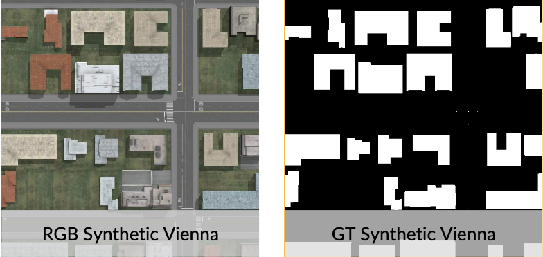
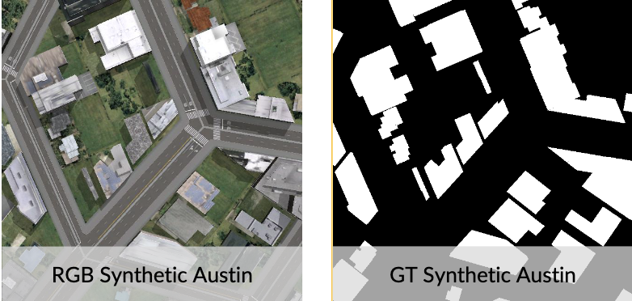

# README for Designing Synthetic Overhead Imagery to Match a Target Geographic Region: Preliminary Results Training Deep Learning Models

## Introduction

The synthetic data used to improve object detection in satellite imagery was generated in a software called CityEngine. This document walks through our process for designing synthetic data to match specific domains. Below are examples of image tiles and their corresponding labels used in training.

Below are prediction mask comparisons for before/after augmentation with the synthetic data. Black and white regions are true positives and true negatives respectively. Blue and red regions are false positives and false negatives respectively.

This repository includes the following

- The augmented synthetic city datasets designed for Austin and Vienna based on the changes outlined below
- The necessary CityEngine's .cga rule files to generate the virtual worlds and their labels
- The Python scripts used to 'photograph' the virtual worlds and generate image tiles
- The texture banks used for the specific alterations done
- The two .cej scene files for the specific datasets
- A quick and dirty guide to using CityEngine
- The paper submitted for publication to IGARSS 2020
___

## Overview of Synthetic Data Augmentations

The overarching design and creation of the synthetic data took place in distinct stages that have different levels of human oversight and interaction. After the whole process, one should have a set of synthetic training images with labels for a particular ''target'' city. We created these changes incrementally.

These include four individual changes made to a generic random synthetic city designed to approximate the ''target'' city more closely in one specific regard. These four changes are then all combined into a fifth version of the synthetic city. The 5 changes are:

1. Distribution of building shape and frequency
2. Specificity of textures
3. Lighting variation
4. Road network generation
5. Aggregate changes

The READMEs specific to Austin and Vienna, respectively, describe the changes in detail and how to replicate them.
___
## Usage considerations

The incremental changes mentioned above can be used to optimize synthetic data to more closely resemble the aesthetic qualities of real satellite imagery, but they are not necessarily strict guidelines to follow when trying to make synthetic data look more realistic. There are other changes that can be implemented at any point during the generation and processing of synthetic data that can ultimately boost detection performance in the deep learning model, but using the exact same changes on another set of synthetic data that is meant to resemble different geographic region may not yield consistent results. Thus, when looking to implement incremental changes to the datasets, the main consideration should be how the change can make the synthetic data more visually comparable to the geographic region it is meant to resemble, rather than how much a change boosted object detection performance for another synthetic dataset.
___
## Citation
All work done on this repo was done in preparation for/in conjunction with the work for the paper ("Designing Synthetic Overhead Imagery to Match a Target Geographic Region: Preliminary Results Training Deep Learning Models" by Varun Nair, Paul Rhee, Bohao Huang, Kyle Bradbury, and Jordan Malof) submitted to IEEE Conference on International Geoscience and Remote Sensing Society (IGARSS), 2020.
___
## Acknowledgements

We want to thank the NVIDIA corporation for donating the graphics processing unit (GPU) for this work. Bohao Huang would like to thank the Energy Data Analytics Ph.D. Fellowship program from the Duke University Energy Initiative funded by the Alfred P. Sloan Foundation for supporting his work.
